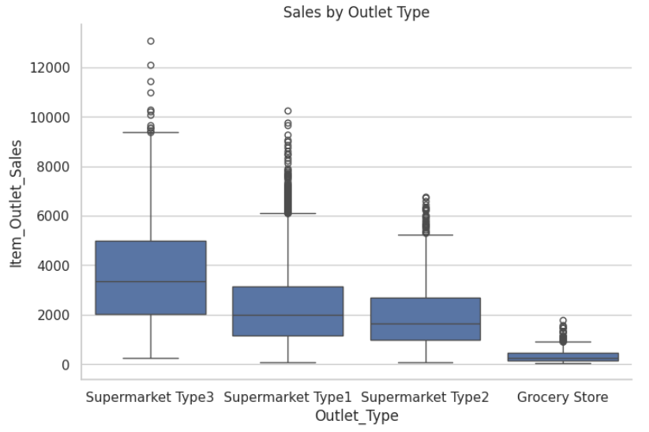
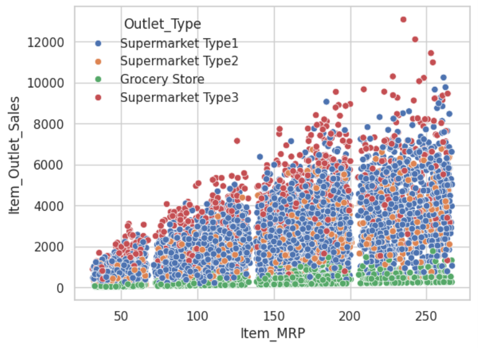

# Prediction-of-Product-Sales
**Goal:** Get hands-on practice with data cleaning, visualization, and inspection using a real retail dataset. The focus is on understanding the data, not building a final model.

  - **Dataset:** Analytics Vidhya – Big Mart Sales III

  - **Tools:** Python · Pandas · NumPy · Matplotlib/Seaborn · Google Colab

**What’s included**

  - Load and clean the data (types, missing values, label fixes, duplicates).

  - Explore distributions (histograms), group differences (box/median plots), category balance (countplots), and numeric relationships (correlation heatmap).

  - Short notes under each figure to capture takeaways.
    
**Quick start**

1. Open notebooks/prediction_of_product_sales.ipynb in Colab or locally.
2. Run the cells to reproduce cleaning steps and visuals.
## Key Visuals

**Sales by Outlet Type**

*Supermarket Type3 has the highest typical sales; Grocery Store is lowest.*

**Price vs Sales**

*Sales rise with list price, with clear price tiers.*

