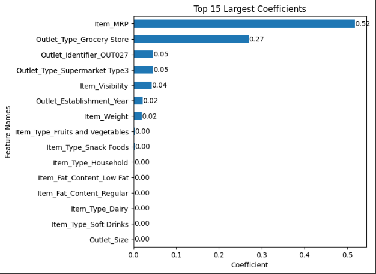

# Prediction-of-Product-Sales
**Goal:** Get hands-on practice with data cleaning, visualization, and inspection using a real retail dataset. The focus is on understanding the data, not building a final model.

  - **Dataset:** Analytics Vidhya – Big Mart Sales III

  - **Tools:** Python · Pandas · NumPy · Matplotlib/Seaborn · Google Colab

**What’s included**

  - Load and clean the data (types, missing values, label fixes, duplicates).

  - Explore distributions (histograms), group differences (box/median plots), category balance (countplots), and numeric relationships (correlation heatmap).

  - Short notes under each figure to capture takeaways.
    
**Quick start**

1. Open notebooks/prediction_of_product_sales.ipynb in Colab or locally.
2. Run the cells to reproduce cleaning steps and visuals.
## Key Visuals

**Sales by Outlet Type**

*Supermarket Type3 has the highest typical sales; Grocery Store is lowest.*

**Price vs Sales**

*Sales rise with list price, with clear price tiers.*

## Model Insights and Interpretations
**1. Linear Regression Model**

**Exported Plot:**

**Interpretation:**
The Linear Regression model identified several factors that strongly affect sales:

- **Item_MRP (price)** has the largest positive coefficient, meaning higher-priced items are associated with higher sales.

- **Outlet_Type_Grocery_Store** shows a negative coefficient, suggesting grocery stores may underperform compared to other outlet types.

- **Outlet_Identifier_OUT027** and **Outlet_Type_Supermarket_Type3** have positive impacts, indicating that these outlet types or locations tend to generate more sales.

In simple terms, the results show that pricing and outlet type are the most influential factors in predicting sales.

**2. Random Forest Model**

**Exported Plot:**

**Interpretation:**
The Random Forest model confirms and refines the linear model’s findings:

- **Item_MRP** is the most important feature, showing that product price is the strongest predictor of sales.

- **Outlet_Type_Grocery_Store** and **Outlet_Type_Supermarket_Type3** are highly influential, highlighting that store format significantly affects performance.

- **Outlet_Identifier_OUT027** remains one of the top outlets, suggesting certain locations consistently outperform others.

- **Item_Visibility** is also important, emphasizing that shelf visibility impacts sales volume.

These results indicate that price, outlet type, and visibility play the largest roles in driving sales.

**3. Final Recommendations to Stakeholders**

**1. Optimize Pricing Strategy:**
Focus on adjusting pricing and promotional strategies around higher-MRP items, as price has the strongest influence on predicted sales.

**2. Prioritize High-Performing Outlets:**
Consider investing in or replicating the operational models of high-performing outlets such as supermarkets and Outlet OUT027.

**3. Enhance Product Visibility:**
Improve product placement and visibility in stores to increase customer awareness and sales potential.

**4. Simplify Future Models:**
Future modeling can focus on the most impactful features (price, outlet type, and visibility) to improve efficiency and interpretability.
